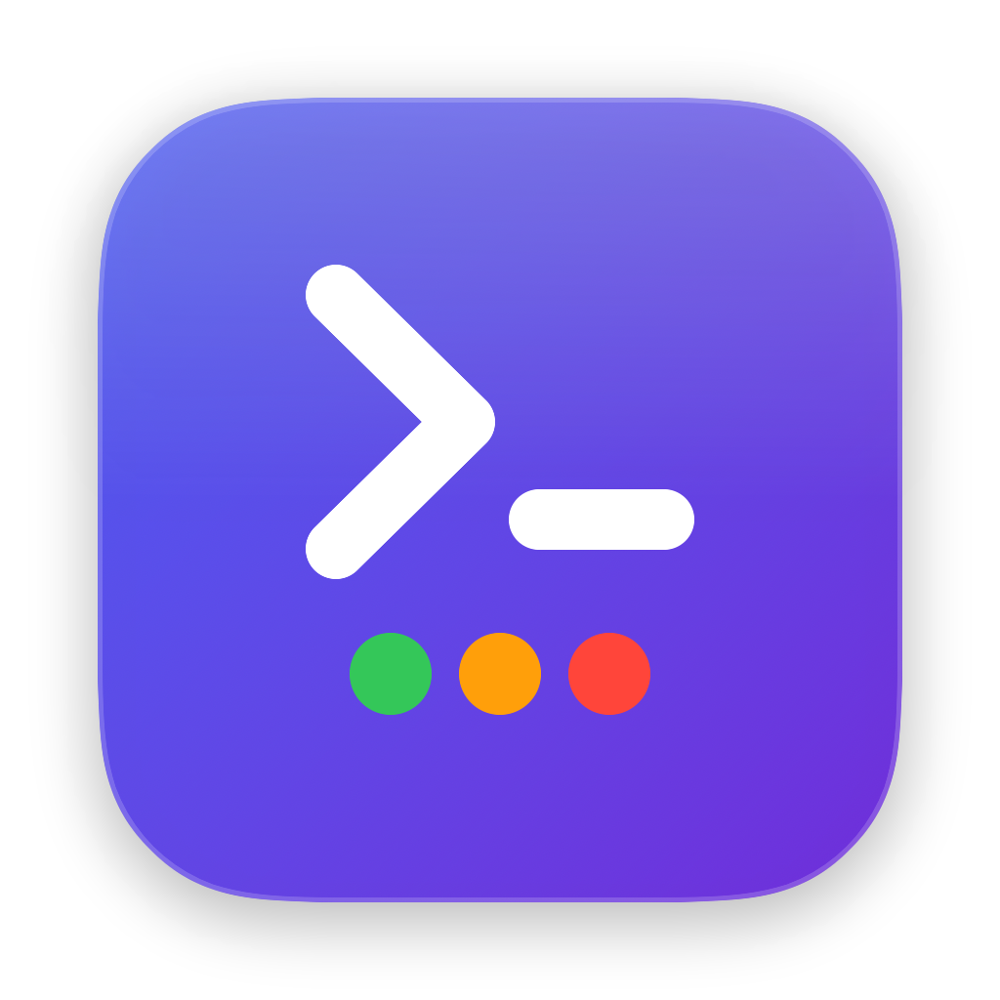

<div align="center">



# HyperEnv

**Switch the environment variables your terminals inherit — per project, per environment, with an undo.**

[](https://github.com/iramarfalcao/hyperenv/actions/workflows/ci.yml)
[](https://github.com/iramarfalcao/hyperenv/releases/latest)
[](LICENSE)
[](#requirements)

[Download](#install) · [How it works](#how-it-works) · [Safety](#safety-model) · [Architecture](docs/ARCHITECTURE.md)

</div>

---

## What it is

HyperEnv is a native macOS app — a window plus a menu bar item — that manages the
environment variables new terminal sessions start with.

You keep **projects**, each holding **profiles** (`dev`, `hml`, `prd`, or your own).
A profile is a list of `KEY=value` pairs. Applying one writes a single generated
file that your shell sources at login, so every terminal you open from that
moment on sees that environment. One click puts it back.

<div align="center">

```
  Projects            Profiles                  Variables
  ──────────          ──────────                ─────────────────────────
  ▸ Default           ▸ dev   DEV               ☑ DATABASE_URL   postgres://…
  ▸ acme-api          ▸ hml   HML               ☑ API_BASE       https://…
  ▸ payments          ▸ prd   PROD   ● ACTIVE   ☑ AWS_PROFILE    payments-prd
                                                ☐ DEBUG          1
  ─────────────────────────────────────────────────────────────────────────
  ● payments / prd · 14 variables in new terminals   Copy reload command | Revert
```

</div>

## The problem it solves

Anyone working against more than one backend ends up with the same three bad
options:

| The usual approach | What goes wrong |
|---|---|
| A pile of `.env` files and `source env/prd.sh` | Nothing tells you which one is loaded. The shell that ran the migration looked identical to the one that did not. |
| Editing `~/.zshrc` by hand for each switch | The file drifts, the backups pile up, and a typo costs you a login shell. |
| Separate terminal profiles per environment | Every new tool — an editor terminal, a task runner, a CI shim — starts outside the setup. |

HyperEnv fixes the part that actually causes incidents: **you can always see
which environment is live**, in the window and in the menu bar, and reverting is
one click rather than an act of memory.

## Where it is useful

- **Multi-environment backend work** — pointing the same repo at dev, staging and
  production databases, queues and API gateways.
- **Multi-client / multi-tenant consulting** — a project per client, each with its
  own credentials and endpoints, none of them leaking into the next.
- **Cloud CLIs** — swapping `AWS_PROFILE`, `AWS_REGION`, `KUBECONFIG`,
  `GOOGLE_APPLICATION_CREDENTIALS` as a set instead of one at a time.
- **Onboarding** — export a project's `dev` profile as a `.env` and hand it over;
  the new hire imports it and is configured.
- **Anywhere a wrong `DATABASE_URL` is expensive** — production profiles are red,
  ask for confirmation before applying, and are called out in the menu bar with a
  shape no other state uses.

## Features

- **Projects and profiles** — a hierarchy that matches how the work is actually
  organised, with `dev` / `hml` / `prd` created for you on every new project.
- **Colour-coded risk** — every profile carries an environment class. Production
  is red everywhere it appears and is the only action that asks first.
- **Always-visible active state** — a status bar naming the live profile and its
  variable count, plus a menu bar item you can read without switching apps.
- **One-click revert** — restores the *previous value* of every variable it
  changed, not merely unsetting them, and unsets the ones that did not exist.
- **Open terminals are handled too** — applying cannot reach shells that are
  already running, so the command that can is one click from the status bar.
- **Drift detection** — tells you when your shell no longer matches what HyperEnv
  applied, including the case a checksum cannot see: something assigned the same
  variable *after* our block and quietly won.
- **First-launch snapshot** — reads your existing shell environment into a
  read-only `Default` profile, bucketed by why each variable was or was not
  considered safe to reuse.
- **`.env` import and export** — three dialects (POSIX shell, quoted dotenv,
  `docker --env-file`), with a preview before anything is written.
- **Secret masking** — values can be hidden in the interface.
- **Menu bar switching** — change profile without bringing the window forward.

## Install

### Homebrew

The repository doubles as a Homebrew tap:

```sh
brew tap iramarfalcao/hyperenv https://github.com/iramarfalcao/hyperenv
brew install --cask hyperenv
```

The download carries macOS's quarantine attribute and Homebrew does not strip
it, so the first launch still needs one command — `brew` prints it, and it is
the same one in [First launch](#first-launch) below. Upgrades are
`brew upgrade --cask hyperenv`; `brew uninstall --cask hyperenv` removes the
app, and `--zap` also removes `~/.config/hyperenv`.

Uninstalling does not touch the block in `~/.zprofile`. Remove the hook from
inside the app first if you want it gone — a leftover block is harmless either
way, since it is guarded and does nothing once the files are missing.

### Download

Grab the latest `HyperEnv-<version>.dmg` from the
[**Releases**](https://github.com/iramarfalcao/hyperenv/releases/latest) page,
open it, and drag **HyperEnv** into **Applications**.

Every release ships a `.sha256` next to the disk image. Verify it before opening:

```sh
shasum -a 256 HyperEnv-1.0.0.dmg
```

### First launch

Public builds are **ad-hoc signed**, not signed with a paid Apple Developer ID,
so Gatekeeper blocks the first launch. Either right-click **HyperEnv** in
Applications and choose **Open**, or run once:

```sh
xattr -dr com.apple.quarantine /Applications/HyperEnv.app
```

If you would rather not trust a binary you did not build,
[build it yourself](#building-from-source) — it takes one command.

### Requirements

| | |
|---|---|
| macOS | 26.5 or later |
| Architecture | Apple silicon and Intel (universal binary) |
| Login shell | `zsh` (the macOS default) |

## How it works

HyperEnv never edits your dotfiles line by line. It adds **one guarded block**
to `~/.zprofile`, once, and everything after that happens in files it owns.

```sh
# >>> hyperenv managed block v1 >>> (do not edit)
[ -r "${HOME}/.config/hyperenv/session.zsh" ] && . "${HOME}/.config/hyperenv/session.zsh"
# <<< hyperenv managed block v1 <<<
```

Applying a profile rewrites `~/.config/hyperenv/session.zsh`:

```sh
# Generated by HyperEnv. Do not edit — changes are overwritten on apply.
# Project: payments
# Profile: prd
# Applied: 2026-08-12T09:14:02Z

[[ -n "$HYPERENV_DISABLE" ]] && return

export AWS_PROFILE='payments-prd'
export DATABASE_URL='postgres://…'
```

New login shells source it and inherit the profile. At the same moment HyperEnv
writes the matching **inverse** script, so the undo exists before you need it and
stays valid even if you delete the app first:

```sh
# ~/.config/hyperenv/unsession.zsh
export AWS_PROFILE='payments-dev'   # restored to what it was
unset DATABASE_URL                  # was not set before, so it goes away
```

<details>
<summary><strong>Why <code>.zprofile</code>, and not <code>.zshrc</code> or <code>.zshenv</code></strong></summary>

`/etc/zprofile` runs `path_helper`, which reorders `PATH`. Anything PATH-related
written to `.zshenv` is silently undone before your shell is ready.

`.zshenv` is also wrong for a second reason: it runs for *every* non-interactive
shell, which would leak profile credentials into unrelated scripts, editor hooks
and cron jobs.

</details>

<details>
<summary><strong>Why already-open terminals do not change</strong></summary>

A parent process cannot rewrite the environment of a child that is already
running — that is a property of Unix, not a limitation of the app. Pretending
otherwise is how tools like this quietly lie to you.

So HyperEnv states it plainly and puts the fix one click away: **Copy reload
command** gives you `source ~/.config/hyperenv/session.zsh`, which brings an
existing shell up to date.

</details>

<details>
<summary><strong>What the first launch reads</strong></summary>

HyperEnv probes your login shell *as if it were not installed*
(`HYPERENV_DISABLE=1`) and sorts what it finds into buckets:

| Bucket | Example | Kept? |
|---|---|---|
| `user` | `EDITOR`, `AWS_PROFILE` | Yes — your configuration |
| `derived` | `HOMEBREW_PREFIX` | Shown, switched off — a tool generated it |
| `session` | `TMPDIR`, `SSH_AUTH_SOCK` | Shown, switched off — different next login |
| `pathLike` | `PATH`, `MANPATH` | Shown, switched off — never frozen wholesale |
| `cosmetic` | `TERM`, prompt state | Shown, switched off |
| `rejected` | `SHELL`, `HOME` | Shown, switched off — cannot be set safely |

Nothing is discarded, because drift comparison later needs to know a variable was
*seen and deliberately excluded*, not merely absent.

</details>

## Safety model

This app writes to the file that starts your login shell. It is built on the
assumption that it will eventually be wrong about something, so every dangerous
step is reversible.

- **Backed up before the first edit.** `~/.zprofile` is copied to
  `~/.config/hyperenv/backups/` before a single byte changes.
- **Only inside the markers.** Insertion and removal are a pure `String → String`
  transform with no I/O, so every edge case is covered by a unit test. Removing
  the block restores the file **byte for byte** — including CRLF line endings and
  a missing trailing newline, both of which would otherwise show up as spurious
  diffs in a dotfiles repo.
- **Nothing happens unasked.** The hook is installed by a button, and applying a
  production profile asks for confirmation.
- **A kill switch that does not need the app.** Setting `HYPERENV_DISABLE=1`
  makes the generated script return immediately:

  ```sh
  HYPERENV_DISABLE=1 zsh -l    # a shell as if HyperEnv were never installed
  ```

- **Truthful undo.** Reverting restores prior values rather than blanking them,
  and a variable that was empty comes back empty rather than unset.
- **The filesystem is the source of truth.** What is applied lives in a JSON
  journal on disk, not in the app's database — a corrupted or migrated store can
  never leave you with mutated dotfiles and no way back.
- **Values are plaintext by design.** `session.zsh` has to be sourceable by
  `zsh`, so masking in the interface is presentation only. Treat the file as you
  would any `.env`: it is `0600` in your home directory, and secrets in it are
  secrets on disk.

## Building from source

```sh
git clone https://github.com/iramarfalcao/hyperenv.git
cd hyperenv

Tests/run-core-checks.sh          # 121 pure-logic checks, no app bundle needed
Tests/run-shell-integration.sh    # drives a real zsh in an isolated ZDOTDIR
Tests/run-layout-checks.sh        # no view may demand more width than the window

Scripts/build-release.sh          # universal, ad-hoc signed -> build/export/HyperEnv.app
Scripts/make-dmg.sh build/export/HyperEnv.app 1.0.0
```

Or open `hyperenv.xcodeproj` in Xcode 26.5+ and press Run.

The shell integration suite is the one that matters: unit tests prove the
generated strings are correct, but only a real `zsh` proves that sourcing them
produces the environment the app promised — and that un-applying puts the
previous values back. It refuses to run anywhere near your real `$HOME`.

## Releasing

Tagging is the whole process. Push a `v*` tag and the
[release workflow](.github/workflows/release.yml) runs both test suites, builds a
universal binary, packages the disk image, and publishes it with a checksum:

```sh
git tag v1.0.1
git push origin v1.0.1
```

Signing and notarization are optional and entirely secret-driven — see
[docs/RELEASING.md](docs/RELEASING.md).

## Documentation

| | |
|---|---|
| [docs/ARCHITECTURE.md](docs/ARCHITECTURE.md) | Layers, why the Core has no I/O, how state is kept |
| [docs/RELEASING.md](docs/RELEASING.md) | Cutting a release, and enabling Developer ID signing |
| [CONTRIBUTING.md](CONTRIBUTING.md) | How to propose a change |
| [CHANGELOG.md](CHANGELOG.md) | What changed, per version |
| [Casks/hyperenv.rb](Casks/hyperenv.rb) | The Homebrew cask, updated automatically on release |

## License

[MIT](LICENSE) © Iramar Falcao
