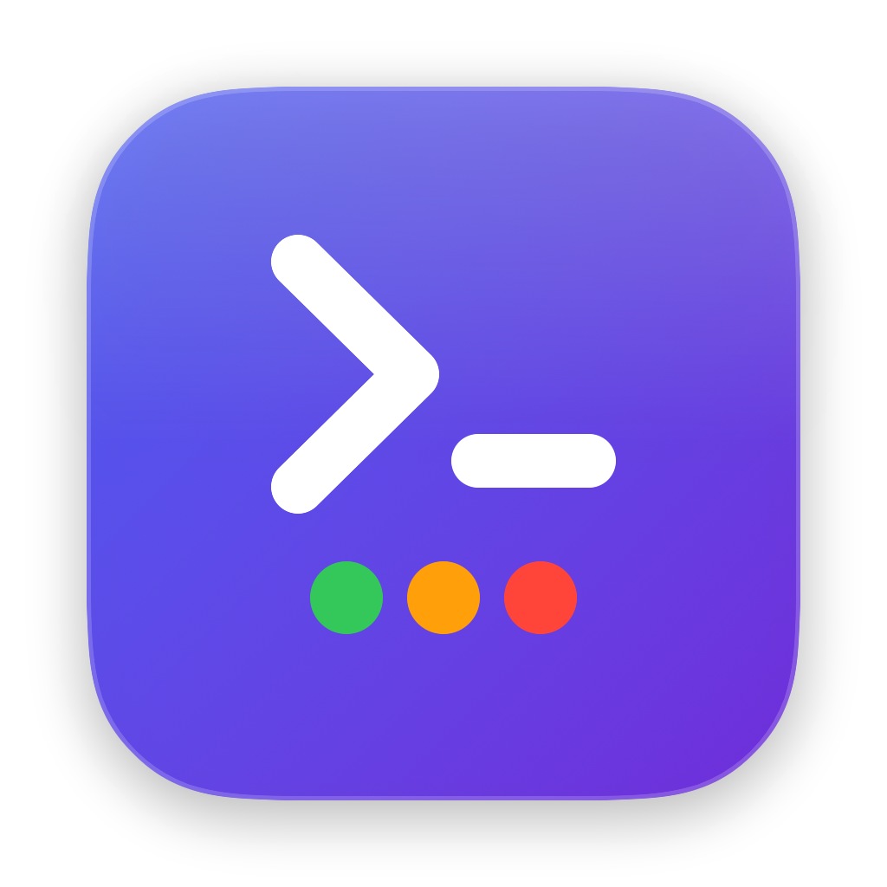
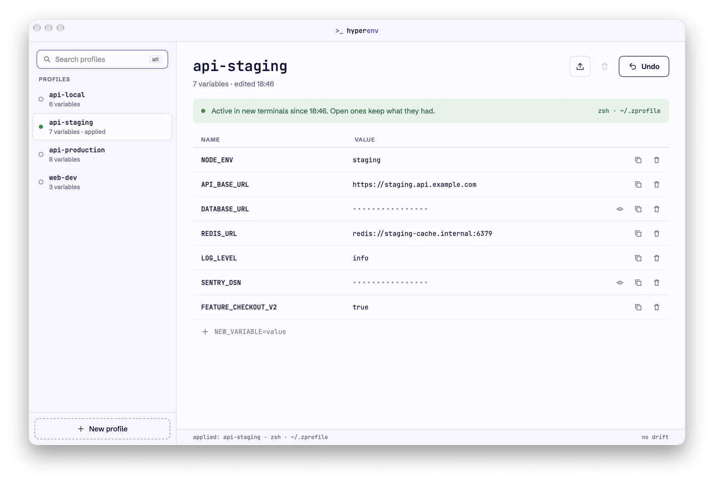

<div align="center">



# HyperEnv

**Switch the environment variables your terminals inherit — per project, per environment, with an undo.**

[](https://github.com/iramarfalcao/hyperenv/actions/workflows/ci.yml)
[](https://github.com/iramarfalcao/hyperenv/releases/latest)
[](LICENSE)
[](#requirements)

[**hyperenv.falcaosl.com**](https://hyperenv.falcaosl.com) · [Download](#install) · [How it works](#how-it-works) · [Safety](#safety-model) · [Architecture](docs/ARCHITECTURE.md)

</div>

---



<div align="center"><sub>Profiles and their variables. The banner and the bar along the bottom always name what is live.</sub></div>

---

## Contents

| | |
|---|---|
| [What it is](#what-it-is) · [The problem it solves](#the-problem-it-solves) · [Where it is useful](#where-it-is-useful) | Why it exists |
| [Features](#features) · [Install](#install) · [How it works](#how-it-works) | Using it |
| [Safety model](#safety-model) · [SECURITY.md](SECURITY.md) | What it will and will not do to your machine |
| [Repository layout](#repository-layout) · [Building from source](#building-from-source) · [ARCHITECTURE.md](docs/ARCHITECTURE.md) · [CONTRIBUTING.md](CONTRIBUTING.md) | Working on it |
| [Releasing](#releasing) · [RELEASING.md](docs/RELEASING.md) | Shipping it |

## What it is

HyperEnv manages the environment variables new terminal sessions start with. It
is a native SwiftUI app on macOS, a desktop app for Windows and Linux, and the
`hyperenv` command on all three — every one of them over the same Rust core.

You keep a list of **profiles** (`api-local`, `api-staging`, `api-production`, or
whatever you name them). A profile is a list of `KEY=value` pairs. Applying one
writes a single generated file that your shell sources at login — on Windows, the
user environment in the registry — so every terminal you open from that moment
on sees that environment. One click puts it back.

## The problem it solves

Anyone working against more than one backend ends up with the same three bad
options:

| The usual approach | What goes wrong |
|---|---|
| A pile of `.env` files and `source env/prd.sh` | Nothing tells you which one is loaded. The shell that ran the migration looked identical to the one that did not. |
| Editing `~/.zshrc` by hand for each switch | The file drifts, the backups pile up, and a typo costs you a login shell. |
| Separate terminal profiles per environment | Every new tool — an editor terminal, a task runner, a CI shim — starts outside the setup. |

HyperEnv fixes the part that actually causes incidents: **you can always see
which environment is live**, in the window's banner and status bar, and reverting
is one click rather than an act of memory.

## Where it is useful

- **Multi-environment backend work** — pointing the same repo at dev, staging and
  production databases, queues and API gateways.
- **Multi-client / multi-tenant consulting** — profiles per client, each with its
  own credentials and endpoints, none of them leaking into the next.
- **Cloud CLIs** — swapping `AWS_PROFILE`, `AWS_REGION`, `KUBECONFIG`,
  `GOOGLE_APPLICATION_CREDENTIALS` as a set instead of one at a time.
- **Onboarding** — export a `dev` profile as a `.env` and hand it over; the new
  hire imports it and is configured.
- **Anywhere a wrong `DATABASE_URL` is expensive** — the applied profile is named
  in the window at all times, and `hyperenv plan <profile>` shows what applying
  would change before anything is written.

## Features

- **Profiles** — a flat, searchable list. Create, rename, duplicate and delete
  (delete asks twice); variables can be switched off without being removed.
- **Always-visible active state** — a banner and a status bar naming the live
  profile, the shell and the startup file it went into. A profile edited after
  it was applied says so, until you apply it again.
- **One-click revert** — restores the *previous value* of every variable it
  changed, not merely unsetting them, and unsets the ones that did not exist.
- **Open terminals are handled too** — applying cannot reach shells that are
  already running, so the command that can is one shortcut away (**Copy Reload
  Command**, ⇧⌘C, in the Environment menu).
- **Drift detection** — tells you when your shell no longer matches what HyperEnv
  applied, including the case a checksum cannot see: something assigned the same
  variable *after* our block and quietly won.
- **`.env` import and export** — import merges a file into a profile; export
  writes quoted dotenv from the app, and POSIX shell or `docker --env-file` too
  from the command (`hyperenv export --dialect`).
- **Secret masking** — values can be hidden in the interface.
- **zsh, bash, fish and PowerShell** — the login shell decides the dialect and
  the startup file; on Windows the variables go to `HKCU\Environment`.
- **The `hyperenv` command and editor plugins** — the same engine from the
  terminal, VS Code and the IntelliJ family. See [docs/CLI.md](docs/CLI.md) and
  [plugins/README.md](plugins/README.md).
- **Coming from 1.x** — on macOS, the first launch of 2.0 with no profiles
  brings the 1.x profiles over (the old store is only read).

## Getting started

1. **Create a profile**, named after the codebase and environment it belongs
   to (`api-staging`).
2. **Enter the variables** as `NAME=value`, or import an existing `.env`.
3. **Apply.** The first apply adds the guarded hook to your startup file
   (after backing it up). Every terminal you open from then on inherits that
   profile, and the window names it until you undo.

## Install

> **HyperEnv is in development.** There is no published release on GitHub right
> now, and the download buttons on the site are switched off. The commands below
> are how installing works once a release is out; until then,
> [build it from source](#building-from-source).

### One command

```sh
curl -fsSL https://hyperenv.falcaosl.com/install.sh | bash
```

Uses Homebrew if you have it and the disk image if you do not, verifies the
published SHA-256 before installing, and clears the quarantine attribute so the
first launch works. It never uses `sudo`. The source is
[`site/install.sh`](site/install.sh) — worth reading before piping anything into
a shell, including this.

### Homebrew

The repository doubles as a Homebrew tap:

```sh
brew tap iramarfalcao/hyperenv https://github.com/iramarfalcao/hyperenv
brew trust iramarfalcao/hyperenv
brew install --cask hyperenv
```

The `brew trust` step is not optional. Homebrew refuses to load a cask from a
third-party tap until you say you trust it — a tap can run code with your user's
privileges, so it wants that stated once, explicitly.

Upgrades are `brew upgrade --cask hyperenv`; `brew uninstall --cask hyperenv`
removes the app, and `--zap` also removes `~/.config/hyperenv`.

Uninstalling does not touch the block in `~/.zprofile`. Remove the hook first
if you want it gone (`/Applications/HyperEnv.app/Contents/Helpers/hyperenv hook
remove`) — a leftover block is harmless either way, since it is guarded and does
nothing once the files are missing.

### Download

[**Download HyperEnv.dmg**](https://github.com/iramarfalcao/hyperenv/releases/latest/download/HyperEnv.dmg)
— always the newest release — then open it and drag **HyperEnv** into
**Applications**. Every release also publishes a versioned copy and a checksum on
the [Releases](https://github.com/iramarfalcao/hyperenv/releases/latest) page.

Verify it before opening:

```sh
curl -LO https://github.com/iramarfalcao/hyperenv/releases/latest/download/HyperEnv.dmg.sha256
shasum -a 256 -c HyperEnv.dmg.sha256
```

### First launch

Release builds are **signed with a Developer ID and notarized**, so the disk
image opens normally — no right-click → Open, no quarantine attribute to strip.
A build made without the signing secrets is signed ad-hoc instead; for one of
those, run once:

```sh
xattr -dr com.apple.quarantine /Applications/HyperEnv.app
```

If you would rather not trust a binary you did not build,
[build it yourself](#building-from-source) — it takes one command.

### Windows and Linux

The desktop app ships as a per-user installer (`.exe`) for Windows and as
`.deb` and AppImage for Linux, x64 and ARM64, in the `cli-v*` releases. The
`hyperenv` command alone installs with
[`site/install-cli.sh`](site/install-cli.sh) (macOS, Linux) or
[`site/install.ps1`](site/install.ps1) (Windows), both checked against the
published `SHA256SUMS`.

### Requirements

| | |
|---|---|
| macOS | 26.5 or later — Apple silicon and Intel (universal binary) |
| Windows, Linux | x64 or ARM64 (desktop app and command) |
| Login shell | `zsh` (the macOS default), `bash` or `fish`; PowerShell on Windows |

## How it works

HyperEnv never edits your dotfiles line by line. It adds **one guarded block**
to `~/.zprofile`, once, and everything after that happens in files it owns.

```sh
# >>> hyperenv managed block v1 >>> (do not edit)
[ -r "${HOME}/.config/hyperenv/session.zsh" ] && . "${HOME}/.config/hyperenv/session.zsh"
# <<< hyperenv managed block v1 <<<
```

Applying a profile rewrites `~/.config/hyperenv/session.zsh`:

```sh
# Generated by HyperEnv. Do not edit — changes are overwritten on apply.
# Profile: payments-prd
# Applied: 2026-08-12T09:14:02Z

[[ -n "$HYPERENV_DISABLE" ]] && return

export AWS_PROFILE='payments-prd'
export DATABASE_URL='postgres://…'
```

New login shells source it and inherit the profile. At the same moment HyperEnv
writes the matching **inverse** script, so the undo exists before you need it and
stays valid even if you delete the app first:

```sh
# ~/.config/hyperenv/unsession.zsh
export AWS_PROFILE='payments-dev'   # restored to what it was
unset DATABASE_URL                  # was not set before, so it goes away
```

<details>
<summary><strong>Why <code>.zprofile</code>, and not <code>.zshrc</code> or <code>.zshenv</code></strong></summary>

`/etc/zprofile` runs `path_helper`, which reorders `PATH`. Anything PATH-related
written to `.zshenv` is silently undone before your shell is ready.

`.zshenv` is also wrong for a second reason: it runs for *every* non-interactive
shell, which would leak profile credentials into unrelated scripts, editor hooks
and cron jobs.

</details>

<details>
<summary><strong>Why already-open terminals do not change</strong></summary>

A parent process cannot rewrite the environment of a child that is already
running — that is a property of Unix, not a limitation of the app. Pretending
otherwise is how tools like this quietly lie to you.

So HyperEnv states it plainly and puts the fix one click away: **Copy reload
command** gives you `source ~/.config/hyperenv/session.zsh`, which brings an
existing shell up to date.

</details>

<details>
<summary><strong>What applying reads first</strong></summary>

Before writing anything, HyperEnv starts your login shell the way a terminal
opens it, with `HYPERENV_DISABLE=1`, to read the environment *as if it were not
installed*. A key's original value is captured once — the first time HyperEnv
takes that key over — and only released on undo. Measuring again later would
record HyperEnv's own value as yours.

</details>

## Safety model

This app writes to the file that starts your login shell. It is built on the
assumption that it will eventually be wrong about something, so every dangerous
step is reversible.

- **Backed up before the first edit.** The startup file (`~/.zprofile` for zsh)
  is copied to `~/.config/hyperenv/backups/` before a single byte changes.
- **Only inside the markers.** Insertion and removal are a pure `String → String`
  transform with no I/O, so every edge case is covered by a unit test. Removing
  the block restores the file **byte for byte** — including CRLF line endings and
  a missing trailing newline, both of which would otherwise show up as spurious
  diffs in a dotfiles repo.
- **Nothing happens unasked.** The startup file is only touched when you apply
  (or run `hyperenv hook install`), and deleting a profile asks twice.
- **A kill switch that does not need the app.** Setting `HYPERENV_DISABLE=1`
  makes the generated script return immediately:

  ```sh
  HYPERENV_DISABLE=1 zsh -l    # a shell as if HyperEnv were never installed
  ```

- **Truthful undo.** Reverting restores prior values rather than blanking them,
  and a variable that was empty comes back empty rather than unset.
- **The filesystem is the source of truth.** What is applied lives in a JSON
  journal on disk, apart from the profiles (`profiles.json`) — a corrupted or
  lost profiles file can never leave you with mutated dotfiles and no way back.
- **Values are plaintext by design.** `session.zsh` has to be sourceable by
  `zsh`, so masking in the interface is presentation only. Treat the file as you
  would any `.env`: it is `0600` in your home directory, and secrets in it are
  secrets on disk.

## Repository layout

One repository holds the app, the editor plugins, the website and the docs.
They ship on different schedules but describe one product, and a change to the
profile format has to be able to touch the app and the plugin in a single
commit.

```
apps/                one folder per platform
  macos/             the macOS app — SwiftUI over the Rust core (crates/ffi);
                     Xcode project, Scripts/ and the app icon (assets/)
  desktop/           the Windows and Linux app — Slint over the same core
crates/              HyperEnv's shared Rust, the same on every platform
  core/              pure logic: profiles, .env, apply/undo plans, generated scripts
  engine/            what touches the machine: startup files, journal, Windows registry
  cli/               the `hyperenv` command for macOS, Linux and Windows
  ffi/               the C interface the macOS app links
plugins/             editor and IDE integrations — see plugins/README.md
  intellij/          IntelliJ family (IDEA, PyCharm, WebStorm, …) — Kotlin, Gradle
  vscode/            VS Code — TypeScript
site/                hyperenv.falcaosl.com — pages, installers, and deploy/ (Dockerfile, nginx)
design/              HyperEnv's design tokens and interface icons, shared by every app
docs/                architecture, releasing, product docs
Casks/               the Homebrew cask, updated on release (must stay at the root)
```

The plugins do not carry an engine of their own. They call the `hyperenv`
command, which ships inside the app bundle and opens the same store and the
same journal the window does — so whichever surface pressed Apply, there is one
engine and one writer to `~/.zprofile`. See [docs/CLI.md](docs/CLI.md).

Each part builds on its own: the app from Xcode or `apps/macos/Scripts/`, the command from
`apps/macos/Scripts/build-cli.sh`, the plugins from their own directories. CI keeps them
apart too — the macOS workflow ignores `plugins/**`, and the plugin workflow
only runs when `plugins/**` changes. Nothing in a plugin can break an app
release, and the reverse holds.

## Building from source

```sh
git clone https://github.com/iramarfalcao/hyperenv.git
cd hyperenv

cargo test --workspace -- --test-threads=1   # core, engine, command, ffi — real zsh, bash, fish, pwsh
cargo run --release -p hyperenv-desktop      # the Windows/Linux app (runs on macOS too)
apps/macos/Scripts/build-cli.sh              # -> apps/macos/build/hyperenv, universal

apps/macos/Scripts/build-release.sh          # universal, ad-hoc signed -> apps/macos/build/export/HyperEnv.app
apps/macos/Scripts/make-dmg.sh apps/macos/build/export/HyperEnv.app 2.0.0
```

Or open `apps/macos/hyperenv.xcodeproj` in Xcode 26.5+ and press Run.

You need Rust (https://rustup.rs) for every target; Xcode builds the Rust core
as part of the macOS app. `HYPERENV_HOME=/some/dir` points the app and the
command at another home folder, so you can try them without touching your
real dotfiles.

The end-to-end checks are the ones that matter: unit tests prove the generated
strings are correct, but only a real shell proves that loading them produces
the environment the app promised — and that un-applying puts the previous
values back. They run against a throwaway home, never your real one.

## Releasing

Tagging is the whole process. Push a `v*` tag and the
[release workflow](.github/workflows/release.yml) runs all four suites, builds a
universal binary, notarizes the app and the disk image when the signing secrets
are set, publishes it with a checksum and points the Homebrew cask at it:

```sh
git tag v2.0.1
git push origin v2.0.1
```

The other surfaces have their own tags: `cli-v*` publishes the `hyperenv`
command and the Windows and Linux app
([cli-release.yml](.github/workflows/cli-release.yml)), and `plugins-v*` the
editor plugins ([plugins-release.yml](.github/workflows/plugins-release.yml)).

Signing and notarization are optional and entirely secret-driven — see
[docs/RELEASING.md](docs/RELEASING.md).

## Documentation

| | |
|---|---|
| [docs/ARCHITECTURE.md](docs/ARCHITECTURE.md) | Layers, why the Core has no I/O, how state is kept |
| [docs/RELEASING.md](docs/RELEASING.md) | Cutting a release, and enabling Developer ID signing |
| [CONTRIBUTING.md](CONTRIBUTING.md) | How to propose a change |
| [CHANGELOG.md](CHANGELOG.md) | What changed, per version |
| [Casks/hyperenv.rb](Casks/hyperenv.rb) | The Homebrew cask, updated automatically on release |
| [docs/CLI.md](docs/CLI.md) | The `hyperenv` command: grammar, JSON shapes, what the plugins rely on |
| [plugins/README.md](plugins/README.md) | The editor plugins, and what state they are actually in |

## License

[MIT](LICENSE) © Iramar Falcao

## Documentação de produto

| Documento | Assunto |
|---|---|
| [`docs/PRODUTO.md`](docs/PRODUTO.md) | O que é, para quem, o que não faz |
| [`docs/STATUS.md`](docs/STATUS.md) | Etapa atual, o que falta, riscos e data-alvo |
| [`docs/MONETIZACAO.md`](docs/MONETIZACAO.md) | Modelo de cobrança |
| [`docs/MARKETING.md`](docs/MARKETING.md) | Posicionamento, mensagens e ativos de campanha |
| [`docs/RELEASING.md`](docs/RELEASING.md) | Processo de release |

Site: [hyperenv.falcaosl.com](https://hyperenv.falcaosl.com) — fonte em [`site/`](site), imagem de deploy em [`site/deploy/`](site/deploy).

---

Um app da [Falcao SL](https://falcaosl.com).
